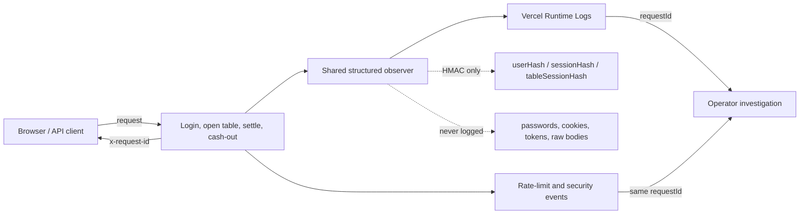

# TaihuCasino #44 Observability Map / 可观测性图解

## Plain-Language Result / 人话结果

Before this change, an operator usually saw only a generic user-facing error. After this change, the response carries a request ID that leads to a structured event chain showing which member flow failed, how long it took, and a safe reason category.

修改前，值班人员通常只能看到用户界面的通用错误。修改后，响应会携带 request ID，可追踪到结构化事件链，看到失败发生在哪条会员流程、耗时多久、属于哪类安全错误。

## Covered Paths / 覆盖路径

- `POST /api/auth/login`
- `POST /api/member/table-sessions`
- `POST /api/member/game-rounds`
- `POST /api/member/table-sessions/[id]/cash-out`

Full field definitions and response steps are documented in `docs/OBSERVABILITY_RUNBOOK.md`.
