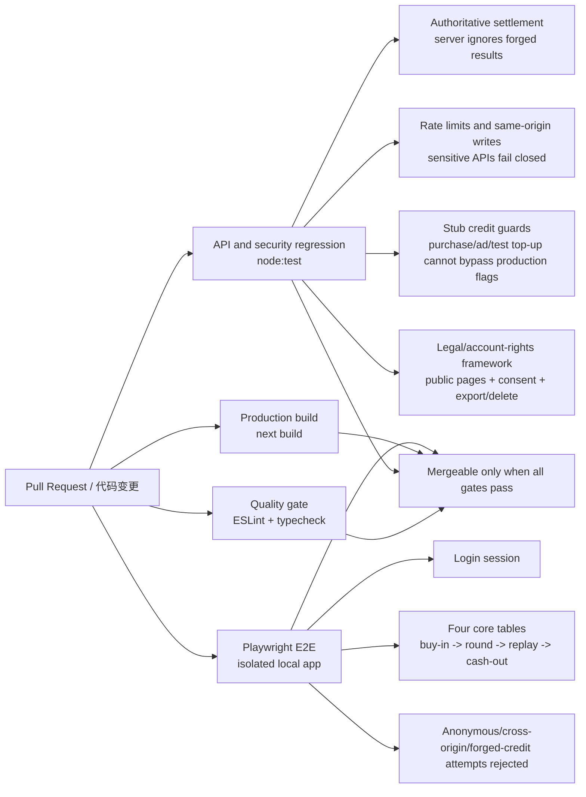

# TaihuCasino #56 Release Gate Map / 发布门禁图解

Status: engineering release-gate framework for GitHub #56 / Linear GHO-35.

## One-Screen Flow / 一屏流程

## What This Protects / 它保护什么

- #54 abuse-protection work: rate-limit coverage, trusted-client identity, fail-closed behavior, and sensitive API route coverage.
- #55 legal/account-rights work: public draft pages, consent/age framework, data export, and two-stage account deletion.
- #48 lint recovery: `pnpm lint` is executable again and part of the release gate.
- Player money-flow boundaries: client-submitted result, `delta`, bankroll, and cash-out balance values must not become authoritative.
- Browser-level main path: isolated Playwright tests start a local app, sign in with a test-only account, and exercise the four core game tables.

## GitHub Actions Jobs / GitHub Actions 门禁

- `Quality gate / 质量门禁`: `pnpm lint` and `pnpm typecheck`.
- `API and security regression / API 与安全回归`: production audit plus Node security tests.
- `Production build / 生产构建`: `pnpm build`.
- `Playwright E2E / 浏览器端到端`: isolated Chromium E2E with failure-only artifacts.

## Failure Evidence / 失败证据

Playwright uploads only local test evidence on failure:

- `playwright-report/`
- `test-results/e2e/`

The E2E account and secrets are explicitly non-production local test values.
